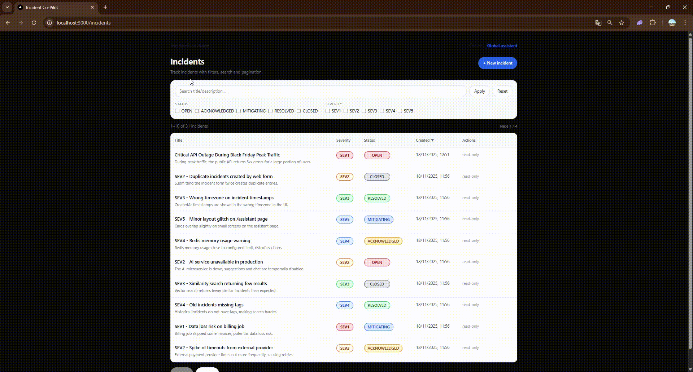

# Incident Co-Pilot

Incident Co-Pilot is a small **incident management** app with a bit of **AI** on top.

You can:

- Create and list incidents (with status + severity)
- Search and filter incidents
- Store vector embeddings in Postgres (pgvector) and run similarity search
- Ask the AI to **suggest / summarize** incidents
- Chat with an AI assistant:
  - per incident (contextual to one incident + similar ones)
  - or globally (questions about the whole list of incidents)

---

## 1. Architecture

Monorepo layout:

```text
incident-copilot/
├─ apps/
│  ├─ api/      # NestJS API (REST) + Prisma + Postgres (pgvector)
│  ├─ web/      # Next.js (App Router) front-end
│  └─ ai/       # FastAPI microservice that talks to OpenAI
└─ infra/
   └─ docker/
      ├─ docker-compose.yml
      ├─ api.env.example
      ├─ web.env.example
      └─ ai.env.example
```

### 1.1 Tech stack

- **API**: NestJS 11, Prisma, Postgres + pgvector  
- **Front-end**: Next.js (App Router), React, inline styles (no Tailwind)  
- **AI service**: FastAPI (Python), official OpenAI client  
- **Infra**: Docker Compose (Postgres, Redis, MinIO, y-websocket, AI, API, Web)

---

## 2. Features

### 2.1 Incidents

- Create incidents with:
  - `title` (required)
  - `description`
  - `severity`: `SEV1`…`SEV5`
  - `status`: `OPEN`, `ACKNOWLEDGED`, `MITIGATING`, `RESOLVED`, `CLOSED`
- Server-side pagination + filters:
  - filter by status / severity
  - text search on title/description
  - sort by created date, title, status, severity

### 2.2 Vector search (pgvector)

- Local **bag-of-words** embedding (768-dim) computed in the API
- Embeddings stored in Postgres vector column (`pgvector`)
- Similarity search endpoint:
  - `GET /incidents/similar?q=...&k=5`
- Rebuild embeddings for all incidents:
  - `POST /incidents/embeddings/rebuild`

### 2.3 AI suggestion & summary

- Endpoint `POST /incidents/suggest`
  - Simple heuristic (regex + tags + severity guess)
  - Calls the Python `ai` service to refine the suggestion (OpenAI)
  - Returns:
    - `summary`
    - `suggestedTitle`
    - `impactSummary`
    - `actionItems[]`
    - `severityProposed`, `statusProposed`
    - `tags[]`, `confidence`
- Endpoint `GET /incidents/:id/summary`
  - Reuses the same suggestion logic to generate an AI summary for one incident

### 2.4 AI chat

- **Per-incident chat**:

  - `POST /incidents/:id/chat`
  - API sends `{ incident, similar_incidents, messages }` to the `ai` microservice
  - Microservice calls OpenAI and returns a reply
  - Front-end shows a mini chat UI (“You” vs “AI” bubbles)

- **Global assistant**:

  - `/assistant` page on the front-end
  - API collects the latest incidents and calls `ai`:
    - `POST /assistant/query`
  - Assistant can answer:
    - questions about incidents (`Which SEV1 incidents happened this week?`)
    - general questions (acts like a normal chatbot)

---

## Demo

### 1. Creating a new incident

This short demo shows how to:

- Open the incidents page
- Use the search 
- Create a new incident with AI suggestion and similar incidents
- See the newly created incident in the list


---

### 2. AI assistant on a single incident

This demo shows the per-incident AI features:

- Viewing the AI-generated summary for an incident
- Asking the “AI assistant for this incident” for root causes and next steps
- Asking about similar past incidents and mitigations


---

### 3. Global assistant

This demo shows the global AI assistant:

- Asking a question about existing incidents (for example: “Which SEV1 incidents exist in the system?”)
- Getting a synthesized answer based on the incident history



---

## 3. API (apps/api)

Main endpoints (simplified):

```text
GET    /incidents                     # list, with filters & pagination
POST   /incidents                     # create incident
PATCH  /incidents/:id                 # update status (controlled transitions)
GET    /incidents/:id                 # get one incident
POST   /incidents/:id/embedding       # recompute vector embedding
GET    /incidents/similar             # vector similarity search
GET    /incidents/:id/summary         # AI summary
POST   /incidents/:id/chat            # incident-scoped AI chat
POST   /incidents/embeddings/rebuild  # rebuild all embeddings

POST   /assistant/query               # global assistant (via AI service)
GET    /health                        # basic healthcheck
```

Status transitions are restricted:

```text
OPEN -> ACKNOWLEDGED -> MITIGATING -> RESOLVED -> CLOSED
```

Status patching can be disabled via environment variable:

```text
ALLOW_STATUS_PATCH=false
```

Security: a simple `x-api-key` header is required for API calls.

---

## 4. Front-end (apps/web)

### 4.1 `/incidents`

- Paginated table of incidents
- Search bar + filters (status / severity)
- Sort by title, severity, status, created date
- Badges with colors for severity and status
- Button “+ New incident”
- Button “Global assistant” in the header
- Small empty state when there are no incidents

### 4.2 `/incidents/new`

- Form to create a new incident
- Buttons:
  - **Suggest** – calls `/api/incidents/suggest`
  - **Find similar** – calls `/api/incidents/similar`
  - **Create** – calls `/api/incidents`
- Shows:
  - Suggested title (with “Use suggested title” button)
  - Impact summary, action items
  - Tags + proposed severity/status + confidence
  - List of similar incidents (title, truncated description, score)

### 4.3 `/incidents/[id]`

- “Summary” card:
  - AI summary
  - Proposed severity/status, tags, confidence
  - Raw JSON block with the summary payload
- “AI assistant for this incident”:
  - mini chat UI
  - uses `/api/incidents/[id]/chat`

### 4.4 `/assistant`

- Global assistant page:
  - simple explanation / examples
  - textarea for the question
  - “Ask” button
  - card showing either:
    - AI answer
    - or an error (“assistant unavailable…”)

---

## 5. AI service (apps/ai)

FastAPI app exposing:

```text
GET  /health
POST /incident-chat
POST /incident-suggest
POST /assistant-query
POST /assistant/query    # alias
```

- Uses `OPENAI_API_KEY` and `OPENAI_MODEL` (default: `gpt-4o-mini`)
- If `AI_PROVIDER=openai`, uses the official OpenAI client
- Otherwise, falls back to simple, deterministic logic (no external calls)

The service:

- **incident-chat**:
  - builds a prompt with incident details + similar incidents
  - returns a single text reply
- **incident-suggest**:
  - heuristic suggestion + optional refinement by OpenAI
- **assistant-query**:
  - global assistant that can use a list of incidents as context

---

## 6. Running with Docker

### 6.1 Prerequisites

- Docker + Docker Compose
- pnpm (only if you want to run parts locally, not strictly required for Docker)

### 6.2 Environment

Check the example env files:

- Root: `.env.example`
- Infra: `infra/docker/api.env.example`, `web.env.example`, `ai.env.example`
- API: `apps/api/.env.example`

Create real `.env` files **locally** (do not commit them):

```bash
cp .env.example .env
cp infra/docker/api.env.example infra/docker/api.env
cp infra/docker/web.env.example infra/docker/web.env
cp infra/docker/ai.env.example infra/docker/ai.env
# fill in OPENAI_API_KEY etc.
```

### 6.3 Start the stack

From the `infra/docker` folder:

```bash
docker compose up --build
```

Default ports:

- API: `http://localhost:3001`
- Web: `http://localhost:3000`
- AI service: `http://localhost:8000`
- Postgres (pgvector): `localhost:5432`

You can then open the web UI on `http://localhost:3000`.

---

## 7. Development (local)

Example (API only):

```bash
cd apps/api
pnpm install
pnpm run prisma:generate
pnpm run start:dev
```

Example (web only):

```bash
cd apps/web
pnpm install
pnpm dev
```

> In practice, the recommended way to run the full app is still via Docker Compose.

---

## 8. Notes / Limitations

- This is a **student / demo project**, not production-ready.
- Security is minimal:
  - simple `x-api-key` on the API
  - no auth / RBAC
- Embeddings are simple bag-of-words vectors, not true transformer embeddings.
- Error handling is basic but tries to always return a clear message to the UI.

---

## 9. License

No explicit license yet.  
For now, treat this as “look at the code, don’t use in production without permission”.
